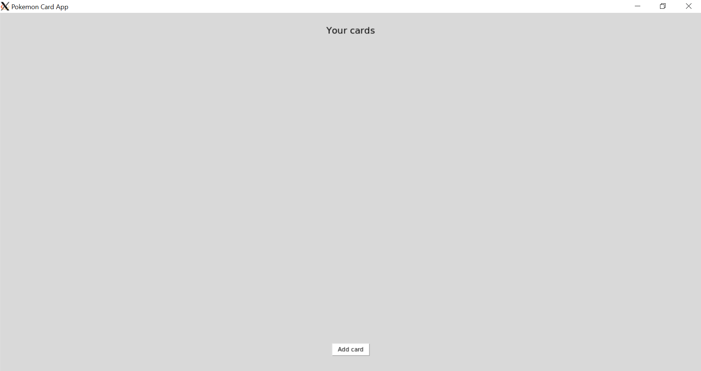

## Käyttöliittymä
Käyttöliittymä sisältää vain yhden näkymän, johon lisätään sisältöä sen ilmestyessä. "Add Card" tuo esille tekstikentät, joiden sisällön perusteella luodaan uusi kortti. Omistettujen korttien määrä näkyy myös oikeasta yläkulmasta. Kortit tulevat automaattisesti näkyviin, jos niitä on olemassa. Jos niitä taas ei ole, korttilista poistuu näkyvistä. Alla kuva kortin lisäysnäkymästä:

## Luokkarakenne
Luokkarakenne selviää alla olevasta kuvasta. Config alustaa tietokantatiedoston, jolla on sitten DB_Connection-tiedoston kautta yhteys korttirepositorioon. Initialize vielä alustaa repositorion, jos tietokannassa ei ole mitään olemassa. Korttirepositorio muodostuu Card-olioista ja kommunikoi pääsovelluksen kanssa. Index luo Tkinter-ikkunan, jota Main_App hallinnoi. Käyttöliittymä koostuu kahdesta näkymästä: kotisivu ja uuden kortin lisäämisen sivu. Kortin lisättyä tai poistettua Main_App kommunikoi tiedon repositorioon, joka sitten muokkaa itse tietokantaa.

## Tietojen tallennus
Sovellus pitää yllä pysyvää tallennusta SQLite-tietokannassa, mikä on myös aina käytettävässä muodossa korttirepositoriossa. Tietokannan määrittelee .env-tiedosto, mikä myös mahdollistaa sovelluksen myöhemmän muuttamisen json-tiedostojen lukemiseen. Tietokanta alustetaan aina sovelluksen käynnistyessä, jotta se on aina olemassa muttei olemassa olevaa tietoa korvata. 

## Sekvenssikaavio
Alla on sekvenssikaavio, joka esittelee kortin lisäämistä. Sovelluksen alustaminen koostuu Tkinter-ikkunan muodostamisesta, tietokannan yhteyden muodostamisesta sekä sen alustamisesta. main_app näyttää automaattisesti kotisivun mutta näkymä muuttuu uuden kortin tekemistä varten. Kun käyttäjä on tehnyt kortin, main_app, kommunikoi tiedon ja kortti lisätään tietokantaan. Tämän jälkeen näkymä vaihtuu takaisin kotisivuun.
