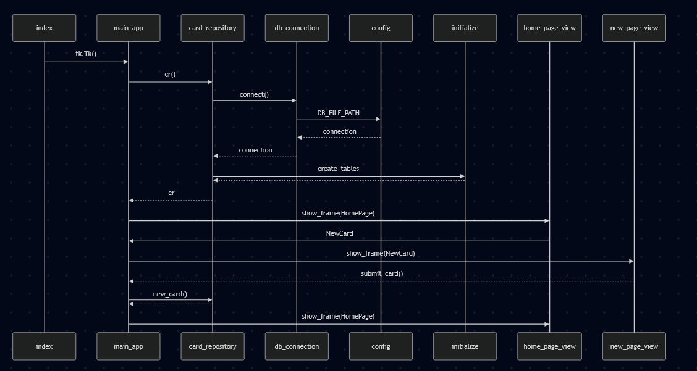

## Käyttöliittymä
Käyttöliittymä sisältää vain yhden näkymän, johon lisätään sisältöä sen ilmestyessä. "Add Card" tuo esille tekstikentät, joiden sisällön perusteella luodaan uusi kortti. Omistettujen korttien määrä näkyy myös oikeasta yläkulmasta. Kortit tulevat automaattisesti näkyviin, jos niitä on olemassa. Jos niitä taas ei ole, korttilista poistuu näkyvistä. Alla kuva kortin lisäysnäkymästä:

## Luokkarakenne
Luokkarakenne selviää alla olevasta kuvasta. Config alustaa tietokantatiedoston, jolla on sitten DB_Connection-tiedoston kautta yhteys korttirepositorioon. Initialize vielä alustaa repositorion, jos tietokannassa ei ole mitään olemassa. Repositorio ja käyttöliittymä toisensa kanssa korttien lisäämisessä ja poistamisessa sekä käyttäjän näkymän muokkaamisessa.
  
  
Sekvenssikaavio, joka esittelee kortin lisäämistä ja poistamista  
