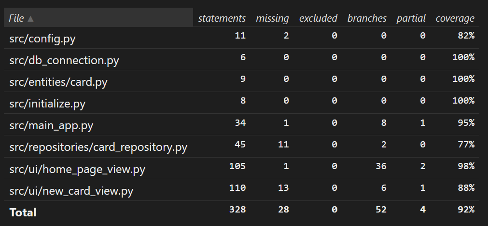

# Testausdokumentaatio
Ohjelman testaus on tehty sekä automaattisilla että manuaalisilla testeillä. 

## Yksikkö- ja integraatiotestaus
### Pääsovelluksen testaus
Sovelluksesta vastaavaa `MainApp`-luokkaa testataan [TestMainApp](https://github.com/Karstonner/ot-harjoitustyo/blob/master/src/tests/main_app_test.py)-testiluokalla. Testejä varten luodaan testitietokannat [test_db](https://github.com/Karstonner/ot-harjoitustyo/blob/master/src/tests/test_db.py)-tiedoston avulla. 

### Repositorion testaus
Repositorio-luokkaa `CardRepository` testataan [TestCardRepository](https://github.com/Karstonner/ot-harjoitustyo/blob/master/src/tests/repositories/card_repository_test.py)-testiluokalla. Myös tämä käyttää testitietokantaa pysyvän tallennuksen sijaan.

### Testien kattavuus
Sovelluksen testien haarautumakattavuus on 92%. Tästä on jätetty ulkopuolelle index.py-tiedosto.

## Järjestelmätestaus
Järjestelmätestaus tehty manuaalisesti.

### Asennus ja konfigurointi
Sovellusta on testattu sekä Linux- että Windows-ympäristössä. Windowsilla vaaditaan erillistä sovellusta Tkinterin ikkunaa varten, käytin Xmingiä. 

### Toiminnallisuudet
Kaikki [vaatimusmäärittelyn](./vaatimusmaarittely.md) ja [käyttöohjeen](./kayttoohje.md) toiminnallisuudet on käyty läpi.