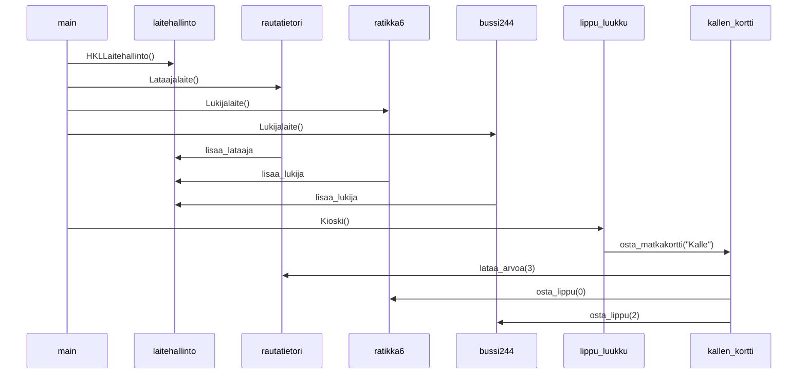

```mermaid
sequenceDiagram
	main->>laitehallinto: HKLLaitehallinto()
	main->>rautatietori: Lataajalaite()
	main->>ratikka6: Lukijalaite()
	main->>bussi244: Lukijalaite()
	rautatietori->>laitehallinto: lisaa_lataaja
	ratikka6->>laitehallinto: lisaa_lukija
	bussi244->>laitehallinto: lisaa_lukija
	main->>lippu_luukku: Kioski()
	lippu_luukku->>kallen_kortti: osta_matkakortti("Kalle")
	kallen_kortti->>rautatietori: lataa_arvoa(3)
	kallen_kortti->>ratikka6: osta_lippu(0)
	kallen_kortti->>bussi244: osta_lippu(2)
```